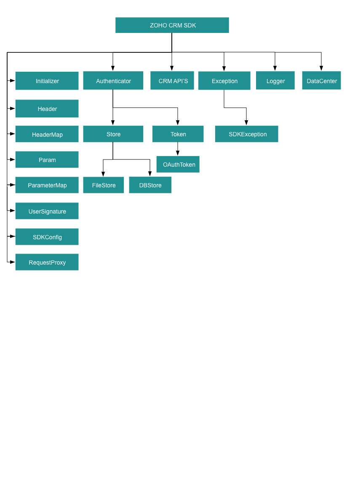

License
=======

    Copyright (c) 2021, ZOHO CORPORATION PRIVATE LIMITED 
    All rights reserved. 

    Licensed under the Apache License, Version 2.0 (the "License"); 
    you may not use this file except in compliance with the License. 
    You may obtain a copy of the License at 
    
        http://www.apache.org/licenses/LICENSE-2.0 
    
    Unless required by applicable law or agreed to in writing, software 
    distributed under the License is distributed on an "AS IS" BASIS, 
    WITHOUT WARRANTIES OR CONDITIONS OF ANY KIND, either express or implied. 
    See the License for the specific language governing permissions and 
    limitations under the License.

# ZOHO CRM SCALA SDK 2.1 for API version 2.1

## Table Of Contents

* [Overview](#overview)
* [Registering a Zoho Client](#registering-a-zoho-client)
* [Environmental Setup](#environmental-setup)
* [Including the SDK in your project](#including-the-sdk-in-your-project)
* [Persistence](#token-persistence)
  * [DataBase Persistence](#database-persistence)
  * [File Persistence](#file-persistence)
  * [Custom Persistence](#custom-persistence)
* [Configuration](#configuration)
* [Initialization](#initializing-the-application)
* [Class Hierarchy](#class-hierarchy)
* [Responses And Exceptions](#responses-and-exceptions)
* [Threading](#threading-in-the-scala-sdk)
  * [Multithreading in a Multi-User App](#multithreading-in-a-multi-user-app)
  * [Multi-threading in a Single User App](#multi-threading-in-a-single-user-app)
* [Sample Code](#sdk-sample-code)

## Overview

Zoho CRM Scala SDK offers a way to create client Scala applications that can be integrated with Zoho CRM.

## Registering a Zoho Client

Since Zoho CRM APIs are authenticated with OAuth2 standards, you should register your client app with Zoho. To register your app:

- Visit this page [https://api-console.zoho.com/](https://api-console.zoho.com)

- Click `ADD CLIENT`.

- Choose the `Client Type`.

- Enter **Client Name**, **Client Domain** or **Homepage URL** and **Authorized Redirect URIs**. Click `CREATE`.

- Your Client app will be created.

- Select the created OAuth client.

- Generate grant token by providing the necessary scopes, time duration (the duration for which the generated token is valid) and Scope Description.

## Environmental Setup

Scala SDK requires java (version 8 and above) and scala version 2.13 and above to be set up in your development environment.

## Including the SDK in your project

Scala SDK is available through Maven distribution. You can include the SDK to your project using:
1. Build.sbt
    ```
    libraryDependencies ++= Seq( "com.zoho.crm" % "zohocrmsdk-2-1" % "1.x.x")
    ```
2. Maven

    - pom.xml file.

    ```xml

    <dependencies>
        <dependency>
            <groupId>com.zoho.crm</groupId>
            <artifactId>zohocrmsdk-2-1</artifactId>
            <version>1.x.x</version>
        </dependency>
    </dependencies>
    ```

3. Gradle

    ```gradle
 
    dependencies{
        implementation 'com.zoho.crm:zohocrmsdk-2-1:1.x.x'
    }
     ```

4. Downloadable JARs ([by Zoho](https://www.zoho.com/sites/default/files/crm/zohocrmsdk-2-1-1.1.0.zip))
 

### Dependency JARs

[commons-io-1.3.2.jar](https://mvnrepository.com/artifact/org.apache.commons/commons-io/1.3.2)

[commons-logging-1.2.3.jar](https://mvnrepository.com/artifact/commons-logging/commons-logging/1.2)

[httpclient-4.5.3.jar](https://mvnrepository.com/artifact/org.apache.httpcomponents/httpclient/4.5.3)

[httpcore-4.4.4.jar](https://mvnrepository.com/artifact/org.apache.httpcomponents/httpcore/4.4.4)

[httpmime-4.5.3.jar](https://mvnrepository.com/artifact/org.apache.httpcomponents/httpmime/4.5.3)

[json-20170516.jar](https://mvnrepository.com/artifact/org.json/json/20170516)

[mysql-connector-scala-5.1.47-bin.jar](https://mvnrepository.com/artifact/mysql/mysql-connector-scala/5.1.47)


## Token Persistence

Token persistence refers to storing and utilizing the authentication tokens that are provided by Zoho. There are three ways provided by the SDK in which persistence can be utilized. They are DataBase Persistence, File Persistence, and Custom Persistence.

### Table of Contents

- DataBase Persistence

- File Persistence

- Custom Persistence

### Implementing OAuth Persistence

Once the application is authorized, OAuth access and refresh tokens can be used for subsequent user data requests to Zoho CRM. Hence, they need to be persisted by the client app.

The persistence is achieved by writing an implementation of the inbuilt **TokenStore interface**, which has the following callback methods.

- **getToken(user: UserSignature, token: Token)** - invoked before firing a request to fetch the saved tokens. This method should return an implementation of **Token interface** object for the library to process it.

- **saveToken(user: UserSignature, token : Token)** - invoked after fetching access and refresh tokens from Zoho.

- **deleteToken(token: Token)** - invoked before saving the latest tokens.

- **getTokens()** - The method to retrieve all the stored tokens.

- **deleteTokens()** - The method to delete all the stored tokens.

- **getTokenById(id: String, token: Token)** - The method to retrieve the user's token details based on unique ID.

### DataBase Persistence

In case the user prefers to use the default DataBase persistence, **MySQL** can be used.

- The database name should be **zohooauth**.

- There must be a table named **oauthtoken** with the following columns.

  - id varchar(255)

  - user_mail varchar(255)

  - client_id varchar(255)

  - client_secret varchar(255)

  - refresh_token varchar(255)

  - access_token varchar(255)

  - grant_token varchar(255)

  - expiry_time varchar(20)

  - redirect_url varchar(255)

Note:
- Custom database name and table name can be set in DBStore instance.

#### MySQL Query

```sql
CREATE TABLE oauthtoken (
  id varchar(255) NOT NULL,
  user_mail varchar(255) NOT NULL,
  client_id varchar(255),
  client_secret varchar(255),
  refresh_token varchar(255),
  access_token varchar(255),
  grant_token varchar(255),
  expiry_time varchar(20),
  redirect_url varchar(255),
  primary key (id)
);
```

#### Create DBStore object

```scala
/*
* 1 -> DataBase host name. Default value "localhost"
* 2 -> DataBase name. Default  value "zohooauth"
* 3 -> DataBase user name. Default value "root"
* 4 -> DataBase password. Default value ""
* 5 -> DataBase port number. Default value "3306"
*/
//TokenStore interface
val tokenstore = new DBStore.Builder()
.host("hostName")
.databaseName("dataBaseName")
.tableName("tableName")
.userName("userName")
.password("password")
.portNumber("portNumber")
.build
```

### File Persistence

In case of default File Persistence, the user can persist tokens in the local drive, by providing the the absolute file path to the FileStore object.

- The File contains.

  - id

  - user_mail

  - client_id

  - client_secret

  - refresh_token

  - access_token

  - grant_token

  - expiry_time

  - redirect_url

#### Create FileStore object

```scala

import com.zoho.api.authenticator.store.FileStore

//Parameter containing the absolute file path to store tokens
var  tokenstore = new FileStore("/Users/user_name/Documents/scala_sdk_token.txt")
```

### Custom Persistence

To use Custom Persistence, the user must extend **TokenStore interface**(**com.zoho.api.authenticator.store.TokenStore**) and override the methods.

```scala
import com.zoho.api.authenticator.Token

import com.zoho.crm.api.exception.SDKException

import com.zoho.crm.api.UserSignature

import com.zoho.api.authenticator.OAuthToken

import scala.collection.mutable.ArrayBuffer

import com.zoho.crm.api.UserSignature

import com.zoho.api.authenticator.store.TokenStore

class CustomeStore extends TokenStore
{
   /**
   * This method is used to get user token details.
 *
   * @param user A User class instance.
   * @param token A Token class instance.
   * @return A Token class instance representing the user token details.
   * @throws SDKException SDKException
   */
  override def getToken(user :UserSignature, token :Token) :Token

  /**
   * This method is used to store user token details.
 *
   * @param user A User class instance.
   * @param token A Token class instance.
   * @throws SDKException SDKException
   */
  override def saveToken(user :UserSignature, token :Token)

  /**
   * This method is used to delete user token details.
   * @param token A Token class instance.
   * @throws SDKException SDKException
   */
  override def deleteToken(token :Token)

  /**
   * The method to retrieve all the stored tokens.
   *
   * @throws SDKException if any problem occurs.
   */
  @throws[SDKException]
  override def getTokens: ArrayBuffer[OAuthToken]

  /**
   * The method to delete all the stored tokens.
   *
   * @throws SDKException if any problem occurs.
   */
  @throws[SDKException]
  override def deleteTokens(): Unit

  /**
	 * This method is used to get user token details by id.
   * 
	 * @param id A String
	 * @param token A Token class instance.
	 * @return A Token class instance representing the user token details.
	 * @throws SDKException if any problem occurs.
	*/
  override def getTokenById(id: String, token: Token): Token
}
```

## Configuration

Before you get started with creating your Scala application, you need to register your client and authenticate the app with Zoho.

| Mandatory Keys    | Optional Keys |
| :---------------- | :------------ |
| user              | logger        |
| environment       | store         |
| token             | SDKConfig     |
|                   | requestProxy  |
|                   | resourcePath  |
-----

- Create an instance of **UserSignature** that identifies the current user.

    ```scala

    import com.zoho.crm.api.UserSignature

    //Create an UserSignature instance that takes user Email as parameter
    var user = new UserSignature("abc@zoho.com")
    ```

- Configure the API environment which decides the domain and the URL to make API calls.

    ```scala
    /*
        * Configure the environment
        * which is of the pattern Domain.Environment
        * Available Domains: USDataCenter, EUDataCenter, INDataCenter, CNDataCenter, AUDataCenter,JPDataCenter
        * Available Environments: PRODUCTION, DEVELOPER, SANDBOX
    */
    val env = USDataCenter.PRODUCTION
    ```

- Create an instance of **OAuthToken** with the information that you get after registering your Zoho client.

    ```scala
    /*
    * Create a Token instance that requires the following
    * clientId -> OAuth client id.
    * clientSecret -> OAuth client secret.
    * refreshToken -> REFRESH token.
    * accessToken -> Access token.
    * grantToken -> GRANT token.
    * id -> User unique id.
    * redirectURL -> OAuth redirect URL.
    */
    //Create a Token instance
    // if refresh token is available
    // The SDK throws an exception, if the given id is invalid.
    var token = new OAuthToken.Builder()
    .id("id")
    .build()

    // if grant token is available
    var token = new OAuthToken.Builder()
    .clientID("clientId")
    .clientSecret("clientSecret")
    .grantToken("grantToken")
    .redirectURL("redirectURL")
    .build()

    // if ID (obtained from persistence) is available
    var token = new OAuthToken.Builder()
    .clientID("clientId")
    .clientSecret("clientSecret")
    .refreshToken("refreshToken")
    .redirectURL("redirectURL")
    .build()

    // if access token is available
    var token = new OAuthToken.Builder()
    .accessToken("accessToken")
    .build()
    ```

- Create an instance of **Logger** Class to log exception and API information. By default, the SDK constructs a Logger instance with level - INFO and file_path - (sdk_logs.log, created in the current working directory)

    ```scala
    
      import com.zoho.api.logger.Logger
      import com.zoho.api.logger.Logger.Levels
    /*
      * Create an instance of Logger Class that takes two parameters
      * level -> Level of the log messages to be logged. Can be configured by typing Levels "." and choose any level from the list displayed.
      * filePath -> Absolute file path, where messages need to be logged.
    */
    var logger = new Logger.Builder()
    .level(Logger.Levels.ALL)
    .filePath("/Users/user_name/Documents/scala_sdk_log.log")
    .build
    ```

- Create an instance of **TokenStore** to persist tokens that are  used for authenticating all the requests.By default, the SDK creates the sdk_tokens.txt created in the current working directory) to persist the tokens.

    ```scala
    /*
    * Create an instance of DBStore that requires the following
    * host -> DataBase host name. Default value "localhost"
    * databaseName -> DataBase name. Default  value "zohooauth"
    * userName -> DataBase user name. Default value "root"
    * password -> DataBase password. Default value ""
    * portNumber -> DataBase port number. Default value "3306"
    * tabletName -> DataBase table name. Default value "oauthtoken"
    */
    //var tokenstore = new DBStore.Builder().build

    var tokenstore = new DBStore.Builder()
    .host("hostName")
    .databaseName("databaseName")
    .tableName("tableName")
    .userName("userName")
    .password("password")
    .portNumber("portNumber")
    .build
    //var tokenstore = new FileStore("/Users/user_name/Documents/scala_sdk_token.txt")

    //var tokenStore = new CustomStore()
    ```

- Create an instance of **SDKConfig** containing the SDK configuration.

    ```scala
    /*
    * autoRefreshFields
    * if true - all the modules' fields will be auto-refreshed in the background, every    hour.
    * if false - the fields will not be auto-refreshed in the background. The user can manually delete the file(s) or refresh the fields using methods from ModuleFieldsHandler(com.zoho.crm.api.util.ModuleFieldsHandler)
    *
    * pickListValidation
    * A boolean field that validates user input for a pick list field and allows or disallows the addition of a new value to the list.
    * True - the SDK validates the input. If the value does not exist in the pick list, the SDK throws an error.
    * False - the SDK does not validate the input and makes the API request with the user’s input to the pick list
    * 
    * connectionTimeout
    * A Integer field to set connection timeout 
    * 
    * requestTimeout
    * A Integer field to set request timeout 
    * 
    * socketTimeout
    * A Integer field to set socket timeout 
    */
    var sdkConfig = new SDKConfig.Builder().pickListValidation(false).autoRefreshFields(false).connectionTimeout(1000).requestTimeout(1000).socketTimeout(1000).build
    ```

- The path containing the absolute directory path to store user-specific files containing module fields information. By default, the SDK stores the user-specific files within a folder in the current working directory.

    ```scala
    var resourcePath = "/Users/user_name/Documents/scalasdk-application"
    ```

- Create an instance of **RequestProxy** containing the proxy properties of the user.

    ```scala
    /*
    * Create an instance of RequestProxy
    * host -> proxyHost
    * port -> proxyPort
    * user -> proxyUser
    * password -> password
    * userDomain -> userDomain
    */
    var requestProxy = new RequestProxy.Builder()
      .host("proxyHost")
      .port(80)
      .user("proxyUser")
      .password("password")
      .userDomain("userDomain")
      .build()
    ```

## Initializing the Application

Initialize the SDK using the following code.

```scala
import com.zoho.api.authenticator.OAuthToken
import com.zoho.api.authenticator.Token
import com.zoho.api.authenticator.store.DBStore
import com.zoho.api.authenticator.store.FileStore
import com.zoho.api.authenticator.store.TokenStore
import com.zoho.crm.api
import com.zoho.crm.api.{Initializer, RequestProxy, SDKConfig, UserSignature}
import com.zoho.crm.api.dc.DataCenter.Environment
import com.zoho.crm.api.dc.USDataCenter
import com.zoho.api.logger.Logger
import com.zoho.api.logger.Logger.Levels

object Initialize {
  @throws[Exception]
  def main(args: Array[String]): Unit = {
    initialize()
  }

  @throws[Exception]
  def initialize(): Unit = {
    /*
    * Create an instance of Logger Class that takes two parameters
    * level -> Level of the log messages to be logged. Can be configured by typing Levels "." and choose any level from the list displayed.
    * filePath -> Absolute file path, where messages need to be logged.
    */
    val loggerInstance = new Logger.Builder()
      .level(Logger.Levels.ALL)
      ..filePath("/Users/user_name/Documents/scala_sdk_log.log")
      .build

    //Create an UserSignature instance that takes user Email as parameter
    val user = new UserSignature("abch.a@zoho.com")

    /*
     * Configure the environment
     * which is of the pattern Domain.Environment
     * Available Domains: USDataCenter, EUDataCenter, INDataCenter, CNDataCenter, AUDataCenter,JPDataCenter
     * Available Environments: PRODUCTION, DEVELOPER, SANDBOX
     */
    val env = USDataCenter.PRODUCTION

    /*
    * Create a Token instance that requires the following
    * clientId -> OAuth client id.
    * clientSecret -> OAuth client secret.
    * refreshToken -> REFRESH token.
    * grantToken -> GRANT token.
    * id -> User unique id.
    * redirectURL -> OAuth redirect URL.
    */
    val token = new OAuthToken.Builder()
      .clientID("clientId")
      .clientSecret("clientSecret")
      .refreshToken("refreshToken")
      .redirectURL("redirectURL")
      .build()
    
    /*
    * Create an instance of DBStore that requires the following
    * host -> DataBase host name. Default value "localhost"
    * databaseName -> DataBase name. Default  value "zohooauth"
    * userName -> DataBase user name. Default value "root"
    * password -> DataBase password. Default value ""
    * portNumber -> DataBase port number. Default value "3306"
    * tabletName -> DataBase table name. Default value "oauthtoken"
    */
//    val tokenstore = new DBStore.Builder().build
    val tokenstore = new DBStore.Builder()
      .host("hostName")
      .databaseName("databaseName")
      .tableName("tableName")
      .userName("userName")
      .password("password")
      .portNumber("portNumber")
      .build

//    val tokenStore = new FileStore("absolute_file_path")

    /*
      * autoRefreshFields
      * if true - all the modules' fields will be auto-refreshed in the background, every hour.
      * if false - the fields will not be auto-refreshed in the background. The user can manually delete the file(s) or refresh the fields using methods from ModuleFieldsHandler(com.zoho.crm.api.util.ModuleFieldsHandler)
      *
      * pickListValidation
      * A boolean field that validates user input for a pick list field and allows or disallows the addition of a new value to the list.
      * if true - the SDK validates the input. If the value does not exist in the pick list, the SDK throws an error.
      * if false - the SDK does not validate the input and makes the API request with the user’s input to the pick list
      */
    var config : SDKConfig = new SDKConfig.Builder()
    .pickListValidation(false)
    .autoRefreshFields(false)
    .build

    val resourcePath = "/Users/user_name/Documents/scalasdk-application"

    /*
    * Create an instance of RequestProxy
    * host -> proxyHost
    * port -> proxyPort
    * user -> proxyUser
    * password -> password
    * userDomain -> userDomain
    */
   var requestProxy = new RequestProxy.Builder()
     .host("proxyHost")
     .port(80)
     .user("proxyUser")
     .password("password")
     .userDomain("userDomain")
     .build()

    /*
      * Set the following in InitializeBuilder
      * user -> UserSignature instance
      * environment -> Environment instance
      * token -> Token instance
      * store -> TokenStore instance
      * SDKConfig -> SDKConfig instance
      * resourcePath -> resourcePath - A String
      * logger -> Log instance (optional)
      * requestProxy -> RequestProxy instance (optional)
    */
    new Initializer.Builder()
      .user(user)
      .environment(env)
      .token(token)
      .store(tokenstore)
      .SDKConfig(config)
      .resourcePath(resourcePath)
      .logger(loggerInstance)
      .initialize()
    //		token.remove()
  }
}
```

- You can now access the functionalities of the SDK. Refer to the sample codes to make various API calls through the SDK.

## Class Hierarchy



## Responses and Exceptions

All SDK method calls return an instance of the **APIResponse** class.

Use the **getObject()** method in the returned **APIResponse** object to obtain the response handler interface depending on the type of request (**GET, POST,PUT,DELETE**).

**APIResponse&lt;ResponseHandler&gt;** and **APIResponse&lt;ActionHandler&gt;** are the common wrapper objects for Zoho CRM APIs’ responses.

Whenever the API returns an error response, the response will be an instance of **APIException** class.

All other exceptions such as SDK anomalies and other unexpected behaviours are thrown under the **SDKException** class.

- For operations involving records in Tags
  - **APIResponse&lt;RecordActionHandler&gt;**

- For getting Record Count for a specific Tag operation
  
  - **APIResponse&lt;CountHandler&gt;**

- For operations involving BaseCurrency

  - **APIResponse&lt;BaseCurrencyActionHandler&gt;**

- For Lead convert operation

  - **APIResponse&lt;ConvertActionHandler&gt;**

- For retrieving Deleted records operation

  - **APIResponse&lt;DeletedRecordsHandler&gt;**

- For  Record image download operation

  - **APIResponse&lt;DownloadHandler&gt;**

- For MassUpdate record operations

  - **APIResponse&lt;MassUpdateActionHandler&gt;**

  - **APIResponse&lt;MassUpdateResponseHandler&gt;**

### GET Requests

- The **getObject()** of the returned APIResponse instance returns the response handler interface.

- The **ResponseHandler interface** interface encompasses the following
  - **ResponseWrapper class** (for **application/json** responses)
  - **FileBodyWrapper class** (for File download responses)
  - **APIException class**

- The **CountHandler interface** encompasses the following
  - **CountWrapper class** (for **application/json** responses)
  - **APIException class**

- The **DeletedRecordsHandler interface** encompasses the following
  - **DeletedRecordsWrapper class** (for **application/json** responses)
  - **APIException class**

- The **DownloadHandler interface** encompasses the following
  - **FileBodyWrapper class** (for File download responses)
  - **APIException class**

- The **MassUpdateResponseHandler interface** encompasses the following
  - **MassUpdateResponseWrapper class** (for **application/json** responses)
  - **APIException class**

### POST, PUT, DELETE Requests

- The **getObject()** of the returned APIResponse instance returns the action handler interface.

- The **ActionHandler interface** encompasses the following
  - **ActionWrapper class** (for **application/json** responses)
  - **APIException class**

- The **ActionWrapper class** contains **Property/Properties** that may contain one/list of **ActionResponse interfaces**.

- The **ActionResponse interface** encompasses the following
  - **SuccessResponse class** (for **application/json** responses)
  - **APIException class**

- The **ActionHandler interface** encompasses the following
  - **ActionWrapper class** (for **application/json** responses)
  - **APIException class**

- The **RecordActionHandler interface** encompasses the following
  - **RecordActionWrapper class** (for **application/json** responses)
  - **APIException class**

- The **BaseCurrencyActionHandler interface** encompasses the following
  - **BaseCurrencyActionWrapper class** (for **application/json** responses)
  - **APIException class**

- The **MassUpdateActionHandler interface** encompasses the following
  - **MassUpdateActionWrapper class** (for **application/json** responses)
  - **APIException class**

- The **ConvertActionHandler interface** encompasses the following
  - **ConvertActionWrapper class** (for **application/json** responses)
  - **APIException class**

## Threading in the scala SDK

Threads in a scala program help you achieve parallelism. By using multiple threads, you can make a scala program run faster and do multiple things simultaneously.

The **scala SDK** supports both single-threading and multi-threading irrespective of a single-user or a multi-user app.

### Multithreading in a Multi-user App

Multi-threading for multi-users is achieved using Initializer's static **switchUser()**.

```scala
import com.zoho.crm.api.Initializer

new Initializer.Builder()
  .user(user)
  .environment(environment)
  .token(token)
  .SDKConfig(sdkConfig)
  .switchUser()
```

Here is a sample code to depict multi-threading for a multi-user app.

```scala
import com.zoho.api.authenticator.OAuthToken
import com.zoho.api.authenticator.Token
import com.zoho.api.authenticator.store.{DBStore, FileStore, TokenStore}
import com.zoho.crm.api.Initializer
import com.zoho.crm.api.RequestProxy
import com.zoho.crm.api.SDKConfig
import com.zoho.crm.api.UserSignature
import com.zoho.crm.api.dc.{DataCenter, USDataCenter}
import com.zoho.crm.api.exception.SDKException
import com.zoho.api.logger.Logger
import com.zoho.crm.api.record.RecordOperations


object MultiThread {
  @throws[SDKException]
  def main(args: Array[String]): Unit = {
    val loggerInstance = new Logger.Builder()
      .level(Logger.Levels.ALL)
      .filePath("/Users/user_name/Documents/scala-sdk-logs.log")
      .build
    val env = USDataCenter.PRODUCTION
    val user1 = new UserSignature("abc.a@zoho.com")
    val tokenstore = new FileStore("/Users/user_name/Documents/scala_sdk_token.txt")
    val token1 = new OAuthToken.Builder()
      .clientID("1000.xxxxx")
      .clientSecret("xxxxxx")
      .refreshToken("1000.xx.xx")
      .redirectURL("https://www.zoho.com")
      .build()
    val resourcePath = "/Users/user_name/Documents/"
    val user1Config = new SDKConfig.Builder()
      .autoRefreshFields(false)
      .pickListValidation(true)
      .build
    new Initializer.Builder()
      .user(user1)
      .environment(env)
      .token(token1)
      .store(tokenstore)
      .SDKConfig(user1Config)
      .resourcePath(resourcePath)
      .logger(loggerInstance)
      .initialize()
    var multiThread = new MultiThread(user1, env, token1, "Deals", user1Config, null)
    multiThread.start()
    val environment = USDataCenter.PRODUCTION
    val user2 = new UserSignature("abc@zoho.com")
    val token2 = new OAuthToken.Builder()
      .clientID("1000.xxxxx")
      .clientSecret("xxxxx")
      .refreshToken("1000.xxxx.xxxxx")
      .build()
    val user2Proxy = new RequestProxy.Builder()
      .host("proxyHost")
      .port(80)
      .user("proxyUser")
      .password("password")
      .userDomain("userDomain")
      .build()
    val user2Config = new SDKConfig.Builder()
      .autoRefreshFields(true)
      .pickListValidation(false).build
    multiThread = new MultiThread(user2, environment, token2, "Leads", user2Config, user2Proxy)
    multiThread.start()
  }
}

class MultiThread(var user: UserSignature, var environment: DataCenter.Environment, var token: Token, var moduleAPIName: String, var sdkConfig: SDKConfig, var userProxy: RequestProxy) extends Thread {
  override def run(): Unit = {
    try {
      new Initializer.Builder()
        .user(user)
        .environment(environment)
        .token(token)
        .SDKConfig(sdkConfig)
        .switchUser()
      println(Initializer.getInitializer.getUser.getEmail)
      val cro = new RecordOperations
      val getResponse = cro.getRecords(this.moduleAPIName, None, None)
      println(getResponse.get.getObject)
    } catch {
      case e: Exception =>
        e.printStackTrace()
    }
  }
}
```

- The program execution starts from main().

- The details of **"user1"** are given in the variables user1, token1, environment1.

- Similarly, the details of another user **"user2"** are given in the variables user2, token2, environment2.

- For each user, an instance of **MultiThread class** is created.

- When **start()** is called which in-turn invokes the **run()**,  the details of user1 are passed to the **switchUser** function through the **MultiThread object**. Therefore, this creates a thread for user1.

- Similarly, When the **start()** is invoked again,  the details of user2 are passed to the switchUser function through the **MultiThread object**. Therefore, this creates a thread for user2.

### Multi-threading in a Single User App

```scala
import com.zoho.api.authenticator.OAuthToken
import com.zoho.api.authenticator.store.FileStore
import com.zoho.crm.api.Initializer
import com.zoho.crm.api.SDKConfig
import com.zoho.crm.api.UserSignature
import com.zoho.crm.api.dc.USDataCenter
import com.zoho.api.logger.Logger
import com.zoho.crm.api.record.RecordOperations

object MultiThread {
  @throws[Exception]
  def main(args: Array[String]): Unit = {
    val loggerInstance = new Logger.Builder()
      .level(Logger.Levels.ALL)
      .filePath("/Users/user_name/Documents/scala-sdk-logs.log")
      .build
    val env = USDataCenter.PRODUCTION
    val user1 = new UserSignature("abc.a@zoho.com")
    val tokenstore = new FileStore("/Users/user_name/Documents/scala_sdk_token.txt")
    val token1 = new OAuthToken.Builder()
      .clientID("1000.xxxxxx")
      .clientSecret("xxxxxx")
      .refreshToken("1000.xxxxxx")
      .redirectURL("https://www.zoho.com")
      .build()
    val resourcePath = "/Users/user_name/Documents"
    val sdkConfig = new SDKConfig.Builder()
      .autoRefreshFields(false)
      .pickListValidation(true)
      .build
    new Initializer.Builder()
      .user(user1)
      .environment(env)
      .token(token1)
      .store(tokenstore)
      .SDKConfig(sdkConfig)
      .resourcePath(resourcePath)
      .logger(loggerInstance)
      .initialize()
    var mtsu = new MultiThread("Deals")
    mtsu.start()
    mtsu = new MultiThread("Leads")
    mtsu.start()
  }
}

class MultiThread(var moduleAPIName: String) extends Thread {
  override def run(): Unit = {
    try {
      val cro = new RecordOperations
      @SuppressWarnings(Array("rawtypes")) val getResponse = cro.getRecords(this.moduleAPIName, None, None)
      println(getResponse.get.getObject)
    } catch {
      case e: Exception =>
        e.printStackTrace()
    }
  }
}
```

- The program execution starts from **main()** where the SDK is initialized with the details of user and an instance of **MultiThread class** is created .

- When the **start()** is called which in-turn invokes the **run()**,  the moduleAPIName is switched through the **MultiThread** object. Therefore, this creates a thread for the particular **MultiThread** instance.

- The **MultiThread** object is reinitialized with a different moduleAPIName.

- Similarly, When the **start()** is invoked again,  the moduleAPIName is switched through the **MultiThread** object. Therefore, this creates a thread for the particular **MultiThread** instance.

## SDK Sample code

```scala
package com.zoho.crm.main

import com.zoho.api.authenticator.Token
import com.zoho.api.authenticator.store.DBStore
import com.zoho.api.authenticator.store.TokenStore
import com.zoho.api.authenticator.OAuthToken
import com.zoho.crm.api.HeaderMap
import com.zoho.crm.api.Initializer
import com.zoho.crm.api.ParameterMap
import com.zoho.crm.api.SDKConfig
import com.zoho.crm.api.UserSignature
import com.zoho.crm.api.dc.DataCenter.Environment
import com.zoho.crm.api.dc.USDataCenter
import com.zoho.api.logger.Logger
import com.zoho.api.logger.Logger.Levels
import com.zoho.crm.api.exception.SDKException
import com.zoho.crm.api.record.RecordOperations
import com.zoho.crm.api.record.APIException
import com.zoho.crm.api.record.ResponseHandler
import com.zoho.crm.api.record.ResponseWrapper
import com.zoho.crm.api.tags.Tag
import com.zoho.crm.api.record.RecordOperations.GetRecordsHeader
import com.zoho.crm.api.record.RecordOperations.GetRecordsParam
import com.zoho.crm.api.util.APIResponse

import java.time.OffsetDateTime
import java.time.ZoneOffset
import java.util

object Record {
  @throws[SDKException]
  def main(args: Array[String]): Unit = {
    /*
      * Create an instance of Logger Class that takes two parameters
      * level -> Level of the log messages to be logged. Can be configured by typing Levels "." and choose any level from the list displayed.
      * filePath -> Absolute file path, where messages need to be logged.
    */
    val loggerInstance = new Logger.Builder()
      .level(Logger.Levels.ALL)
      .filePath("/Users/user_name/Documents/scala-sdk-logs.log")
      .build

    //Create an UserSignature instance that takes user Email as parameter
    val user = new UserSignature("abc@zoho.com")

    /*
      * Configure the environment
      * which is of the pattern Domain.Environment
      * Available Domains: USDataCenter, EUDataCenter, INDataCenter, CNDataCenter, AUDataCenter,JPDataCenter
      * Available Environments: PRODUCTION, DEVELOPER, SANDBOX
    */
    val environment = USDataCenter.PRODUCTION

    /*
      * Create a Token instance that requires the following
      * clientId -> OAuth client id.
      * clientSecret -> OAuth client secret.
      * refreshToken -> REFRESH token.
      * grantToken -> GRANT token.
      * id -> User unique id.
      * redirectURL -> OAuth redirect URL.
    */
    val token = new OAuthToken.Builder()
      .clientID("1000.xxxxxx")
      .clientSecret("xxxxxx")
      .refreshToken("1000.xxxxxx")
      .redirectURL("https://www.zoho.com")
      .build()

    val tokenstore = new FileStore("/Users/user_name/Documents/scala_sdk_token.txt")

    /*
     * autoRefreshFields
     * if true - all the modules' fields will be auto-refreshed in the background, every    hour.
     * if false - the fields will not be auto-refreshed in the background. The user can manually delete the file(s) or refresh the fields using methods from ModuleFieldsHandler(com.zoho.crm.api.util.ModuleFieldsHandler)
     *
     * pickListValidation
     * if true - value for any picklist field will be validated with the available values.
     * if false - value for any picklist field will not be validated, resulting in creation of a new value.
     *
     * connectionTimeout
     * A Integer field to set connection timeout
     *
     * requestTimeout
     * A Integer field to set request timeout
     *
     * socketTimeout
     * A Integer field to set socket timeout
    */
    val sdkConfig = new SDKConfig.Builder()
      .autoRefreshFields(false)
      .pickListValidation(true)
      .connectionTimeout(1000)
      .requestTimeout(1000)
      .socketTimeout(1000)
      .build

    val resourcePath = "/Users/user_name/Documents"

    /*
      * Set the following in InitializeBuilder
      * user -> UserSignature instance
      * environment -> Environment instance
      * token -> Token instance
      * store -> TokenStore instance
      * SDKConfig -> SDKConfig instance
      * resourcePath -> resourcePath - A String
      * logger -> Log instance (optional)
      * requestProxy -> RequestProxy instance (optional)
    */
    new Initializer.Builder()
      .user(user)
      .environment(environment)
      .token(token)
      .store(tokenstore)
      .SDKConfig(sdkConfig)
      .resourcePath(resourcePath)
      .logger(loggerInstance)
      .initialize()
    //		token.remove()

    val moduleAPIName = "Leads"
    val recordOperations = new RecordOperations
    val paramInstance = new ParameterMap
    paramInstance.add(new GetRecordsParam().approved, "both")
    val headerInstance = new HeaderMap
    val enddatetime = OffsetDateTime.of(2020, 5, 20, 10, 0, 1, 0, ZoneOffset.of("+05:30"))
    headerInstance.add(new GetRecordsHeader().IfModifiedSince, enddatetime)
    //Call getRecords method
    val responseOption = recordOperations.getRecords(moduleAPIName, Option(paramInstance), Option(headerInstance))
    if (responseOption.isDefined) {
      val response = responseOption.get
      println("Status Code: " + response.getStatusCode)
      if (util.Arrays.asList(204, 304).contains(response.getStatusCode)) {
        println(if (response.getStatusCode == 204) "No Content"
        else "Not Modified")
      }
      if (response.isExpected) { //Get the object from response
        val responseHandler = response.getObject
        responseHandler match {
          case responseWrapper : ResponseWrapper =>
            //Get the obtained Record instances
            val records = responseWrapper.getData()

            for (record <- records) {
              println("Record ID: " + record.getId)
              var createdByOption = record.getCreatedBy()
              if (createdByOption.isDefined) {
                var createdBy= createdByOption.get
                println("Record Created By User-ID: " + createdBy.getId)
                println("Record Created By User-Name: " + createdBy.getName)
                println("Record Created By User-Email: " + createdBy.getEmail)
              }
              println("Record CreatedTime: " + record.getCreatedTime)
              var modifiedByOption = record.getModifiedBy()
              if (modifiedByOption.isDefined) {
                var modifiedBy = modifiedByOption.get
                println("Record Modified By User-ID: " + modifiedBy.getId)
                println("Record Modified By User-Name: " + modifiedBy.getName)
                println("Record Modified By User-Email: " + modifiedBy.getEmail)
              }
              println("Record ModifiedTime: " + record.getModifiedTime)
              val tags = record.getTag()
              if (tags.nonEmpty) {

                for (tag <- tags) {
                  println("Record Tag Name: " + tag.getName)
                  println("Record Tag ID: " + tag.getId)
                }
              }
              println("Record Field Value: " + record.getKeyValue("Last_Name"))
              println("Record KeyValues: ")


            }
            //Get the Object obtained Info instance
            val infoOption = responseWrapper.getInfo
            //Check if info is not null
            if (infoOption.isDefined) {
              var info = infoOption.get
              if (info.getPerPage().isDefined) { //Get the PerPage of the Info
                println("Record Info PerPage: " + info.getPerPage.toString)
              }
              if (info.getCount.isDefined) { //Get the Count of the Info
                println("Record Info Count: " + info.getCount.toString)
              }
              if (info.getPage.isDefined) { //Get the Page of the Info
                println("Record Info Page: " + info.getPage().toString)
              }
              if (info.getMoreRecords().isDefined) { //Get the MoreRecords of the Info
                println("Record Info MoreRecords: " + info.getMoreRecords().toString)
              }
            }
          case exception : APIException =>
            println("Status: " + exception.getStatus().getValue)
            println("Code: " + exception.getCode().getValue)
            println("Details: ")

            exception.getDetails().foreach(entry=>{
              println(entry._1 + ": " + entry._2)
            })
            println("Message: " + exception.getMessage().getValue)
          case _ =>
        }
      }
      else {
        val responseObject = response.getModel
        val clas = responseObject.getClass
        val fields = clas.getDeclaredFields
        for (field <- fields) {
          println(field.getName + ":" + field.get(responseObject))
        }
      }
    }
  }
}

class Record {}
```
